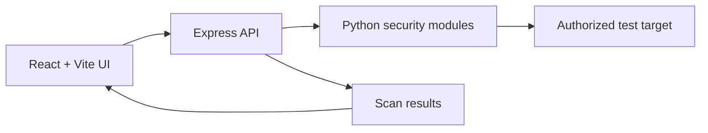

# WebVulnScanner


A web application security testing platform for **authorized security assessments**. It combines a React/Vite interface with an Express backend and Python-based scanning utilities.

> **Authorization required:** use this project only against systems that you own or are explicitly authorized to test.

## What it demonstrates

- Automated crawling with configurable depth and redirect handling
- XSS, SQL injection, HTML injection and LFI test modules
- Web cache poisoning and cache deception checks
- Batch URL scanning and retry/timeout controls
- A browser-based interface for starting and reviewing scans
- Separation between the user interface, API layer and scanning utilities

## Architecture



## Technology stack

| Layer | Technology |
|---|---|
| Frontend | React 18, Vite, TailwindCSS |
| API | Node.js, Express |
| Scanning | Python, Requests, BeautifulSoup, Selenium, aiohttp |
| Quality | ESLint, Vite production build, GitHub Actions |

## Local setup

### Requirements

- Node.js 18+
- npm
- Python 3.7+

### Installation

```bash
git clone https://github.com/Sultan-zd/WebVulnScanner.git
cd WebVulnScanner

# Frontend
npm install

# Backend
cd backend
npm install
pip install -r requirements.txt
cd ..
```

### Run the application

Terminal 1:

```bash
cd backend
node server.js
```

Terminal 2:

```bash
npm run dev
```

Open `http://localhost:5173` in your browser.

## Available API operations

- `/scan-xss`
- `/scan-sqli`
- `/scan-html`
- `/scan-lfi`
- `/scan-poisoning`
- `/scan-deception`
- `/scan-brute`
- `/crawl`
- `/scan-multiple`

## Configuration options

- `intensity`: low, medium or high
- `maxDepth`: maximum crawler depth
- `followRedirects`: whether redirects are followed
- `timeout`: request timeout in seconds
- `maxRetries`: retry count for transient failures

## Validation

```bash
npm run lint
npm run build
```

The repository CI runs these checks automatically for pushes and pull requests.

## Security and responsible use

This is an educational security-testing project. Before running a scan:

1. Obtain explicit written authorization.
2. Define the permitted hosts, paths and testing window.
3. Use a non-production target whenever possible.
4. Avoid destructive payloads and excessive request rates.
5. Do not commit credentials, tokens or target data to the repository.

Please report suspected vulnerabilities in the project through GitHub Issues without including secrets or sensitive evidence.

## Current scope and limitations

The scanner is intended for controlled testing and demonstration. Results require human validation and should not be treated as a complete penetration test or a substitute for a professional security assessment.
